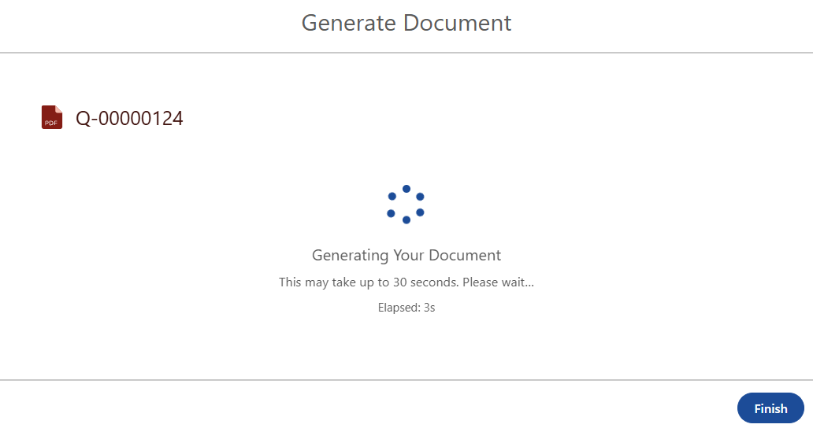
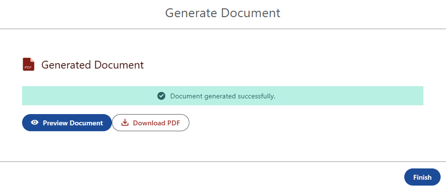
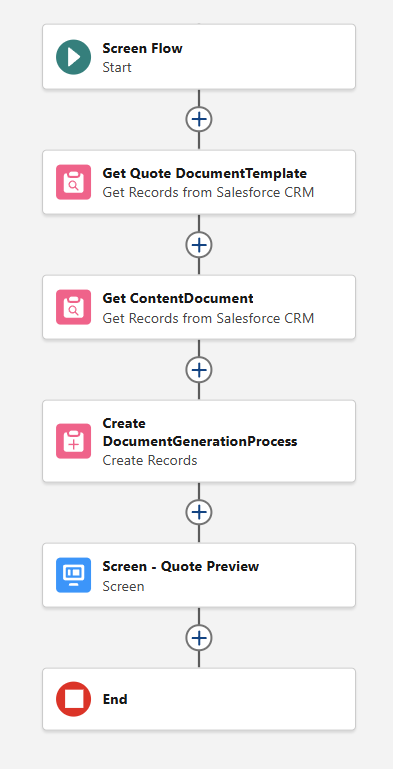
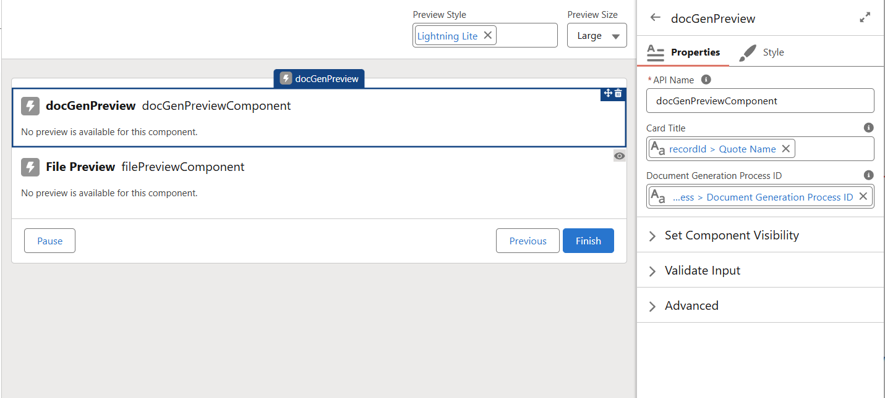
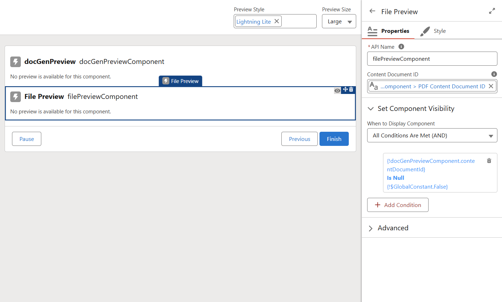

# docGenPreview

> LWC Screen Flow component for Salesforce server-side document generation. Polls a `DocumentGenerationProcess` record, shows a spinner while waiting, then outputs the generated `ContentDocumentId` so the native Salesforce **File Preview** component on the same screen renders the PDF inline.

Works with any flow that creates a `DocumentGenerationProcess` record — the component only cares about the DGP Id, not how the document is built. It was originally built for a **Revenue Cloud / OmniStudio** quote flow using an **OmniDataTransform (DataRaptor)** template, and the example below reflects that setup, but none of it is required: swap in your own template, data source, and request payload.

---

## Screenshots

| Loading                                   | Success (inline preview)                  |
| ----------------------------------------- | ----------------------------------------- |
|  |  |

| Flow Overview                          |
| -------------------------------------- |
|  |

| docGenPreview Properties                               | File Preview Properties                                 |
| ------------------------------------------------------ | ------------------------------------------------------- |
|  |  |

---

## How It Works

When polling detects `Status = Success`, the component fires `FlowAttributeChangeEvent` and outputs the `ContentDocumentId`. The native **File Preview** screen component — placed on the **same** screen and bound to that output — reactively renders the PDF when it receives the Id. No second screen, no iframe, no CSP config, no full-page navigation.

---

## Prerequisites

- Salesforce Document Generation available in your org (`DocumentGenerationProcess`, API 56.0+)
- Org on **Spring '26 or later** (the native File Preview screen component ships in Spring '26)
- A Screen Flow that creates a `DocumentGenerationProcess` record
- A configured document template + data source (the example uses an OmniStudio `DocumentTemplate` with DataRaptor token mapping, but any setup that produces a DGP works)

---

## Installation

```bash
git clone https://github.com/jawndrews/docGenPreview.git
cd docGenPreview
sf org login web --instance-url https://test.salesforce.com --alias myOrg
sf project deploy start --source-dir force-app --target-org myOrg --test-level NoTestRun
```

**VS Code:** Right-click `force-app` → **SFDX: Deploy Source to Org** (requires Salesforce Extension Pack).

---

## Flow Setup

> The steps below are the OmniStudio/DataRaptor quote configuration this was built against — use them as a reference. Any flow that ends in a `DocumentGenerationProcess` record will work; the component just needs that record's Id.

```
Get Document Template  →  Get Content Document  →  Create DGP  →  Screen
```

### Get Document Template

- Object: `DocumentTemplate` / Filter: `Name` = your template name / First record only

### Get Content Document

- Object: `ContentDocument` / Filter: `Title` = your Word filename (no `.docx`) / Sort: `LastModifiedDate` DESC / First record only

### Create Records — `DocumentGenerationProcess`

Store the output in a variable so the Id is available for the screen.

| Field                  | Type      | Value                                                                                                                                                       |
| ---------------------- | --------- | ----------------------------------------------------------------------------------------------------------------------------------------------------------- |
| `DataRaptorInput`      | Formula   | `'{"Id":"' & {!recordId.Id} & '"}'`                                                                                                                         |
| `DocGenApiVersionType` | Text      | `Advanced`                                                                                                                                                  |
| `DocumentInputType`    | Text      | `DocumentTemplate`                                                                                                                                          |
| `DocumentTemplateId`   | Reference | `{!Get_Document_Template.Id}`                                                                                                                               |
| `ReferenceObject`      | Reference | `{!recordId.Id}`                                                                                                                                            |
| `RequestText`          | Formula   | `'{"templateContentVersionId": "' & {!Get_Content_Document.LatestPublishedVersionId} & '", "title":"' & {!recordId.Name} & '", "keepIntermediate": false}'` |
| `Status`               | Text      | `InProgress`                                                                                                                                                |
| `Type`                 | Text      | `GenerateAndConvert`                                                                                                                                        |

Formula fields (`DataRaptorInput`, `RequestText`) require a **Formula resource** (New Resource → Formula → Text) — create these first, then reference in the field value.

> Use **single quotes** for string literals in Flow formulas. Select `Status`, `Type`, and `DocGenApiVersionType` from the **picklist** so Flow stores the API values (`InProgress`, `GenerateAndConvert`, `Advanced`) and not the labels. The `RequestText` format — including spaces after colons and `"keepIntermediate": false` — is enforced by Salesforce.

### Screen

Add a **Screen** element with **two components**.

**1. `docGenPreview`**

| Input                          | Value                   |
| ------------------------------ | ----------------------- |
| Document Generation Process ID | `{!YourDGPVariable.Id}` |
| Card Title                     | e.g. `Quote Document`   |

Bind the output to a Text flow variable (e.g. `varContentDocumentId`):

| Output                  | Variable                  |
| ----------------------- | ------------------------- |
| PDF Content Document ID | `{!varContentDocumentId}` |

**2. Native File Preview component** (from the Flow screen component library)

| Setting              | Value                                                   |
| -------------------- | ------------------------------------------------------- |
| Content Document ID  | `{!varContentDocumentId}`                               |
| Component Visibility | Show when `{!varContentDocumentId}` **Is Null = False** |

When `docGenPreview` finishes polling and fires `FlowAttributeChangeEvent` with the `ContentDocumentId`, File Preview reactively loads the PDF inline. Keep both components on the **same** screen — reactivity is screen-scoped.

---

## Component Properties

| Property                       | Type   | Default              | Description                                                                              |
| ------------------------------ | ------ | -------------------- | ---------------------------------------------------------------------------------------- |
| `dgpId`                        | String | —                    | **Required.** DGP record Id                                                              |
| `cardTitle`                    | String | `Generated Document` | Card header                                                                              |
| `contentDocumentId` _(output)_ | String | —                    | ContentDocumentId (069) — bind to the File Preview component for reactive inline preview |
| `contentVersionId` _(output)_  | String | —                    | ContentVersionId (068) of the generated PDF — handy for a Download action elsewhere      |

---

## Technical Notes

- DGP `Status` values: `InProgress` / `Success` / `Failure`
- The native File Preview component requires a **ContentDocumentId (069)**, not a ContentVersionId (068)
- File Preview renders **PDFs and images** inline; Word/Excel fall back to download
- Polls every 3s, times out after 60 attempts (~3 min), then shows a "Still Processing" state with a Check Again button

---

## License

MIT
